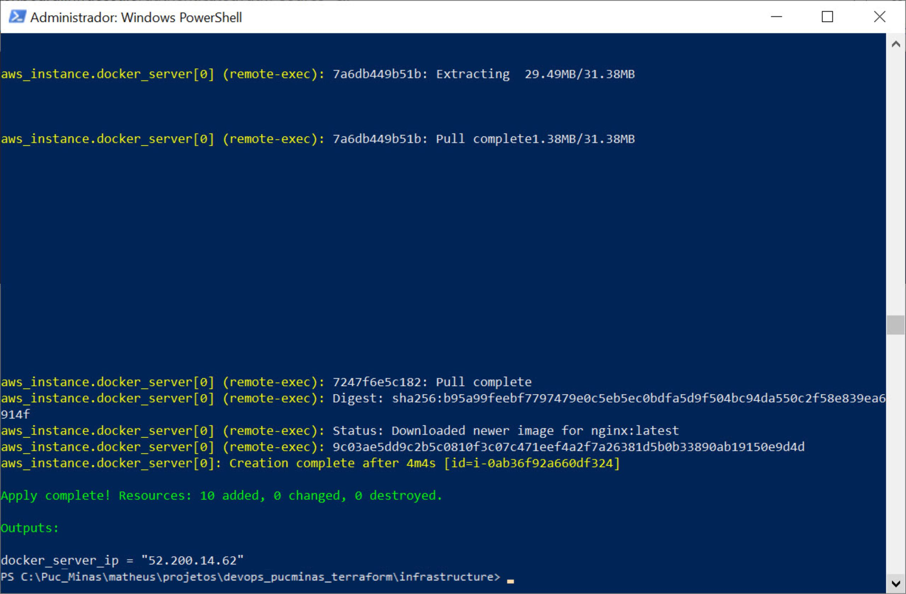
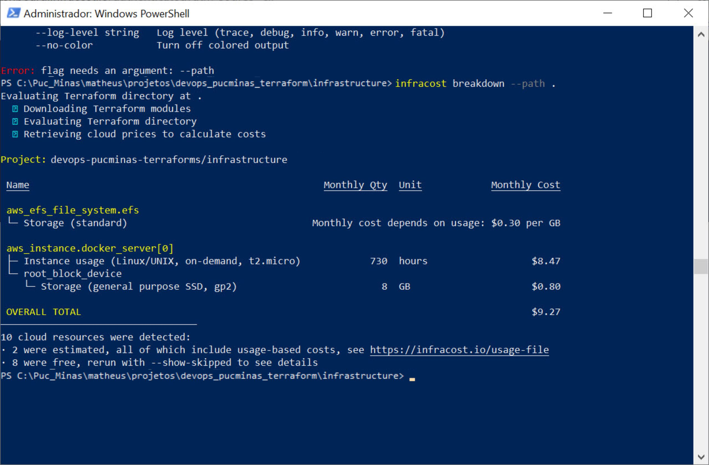

# devops-pucminas-terraforms

### Trabalho do curso de pós graduação em Arquitetura de Soluções

- Disciplina: Cultura e Práticas DevOps
- Professor: Westerley da Silva Reis

### Autor

- Matheus Kreuzer Ladeira Senna

# USO DO TERRAFORM NA AWS

## Trabalho 
Este trabalho tem como objetivo exercitar os seguintes conceitos: 
- Criação de workspace no terraform. 
- Configuração do respositório remoto para armazenar os estados do terraform. 
- Provisionar recursos AWS: VPC, Internet Gateway, Subnet, Rotas, Security Groups, EC2 e EFS. 

## Enunciado 
Você é um Engenheiro DevOps e foi contratado para propor e implementar uma solução em cloud(Provedor AWS). Sua tarefa é implementar uma infraestrutura como código para provisionar recursos que servirão para hospedar uma página web. Ao final da implementação você deverá informar os custos da infraestrutura. 

## Para esse trabalho você precisará: 
- 1 EC2 
- 1 VPC 
- 1 Subnet 
- 1 Route 
- 1 Internet Gateway 
- 1 EFS 
- 1 Bucket S3 

## Instruções 
- Todos os recursos deverão ser provisionados na região `us-east-1`.
- O estado da infraestrutura deverá ser salva em um bucket S3 e com o workspace PROD. 
- Os artefatos do site deverão ser salvos no volume EFS. 
- Versione o código no repositório Github. 

## Dicas 
- Procure por sites HTML gratuitos na internet. 
- Copie o site para uma imagem docker do Nginx. Essa abordagem será melhor do que instalar um servidor Nginx na instância EC2. 
- Para que os artefatos do site fiquem no volume EFS será preciso montar o caminho do nginx (/usr/share/nginx/html) para o EFS. Procure por instruções de como montar o volume EFS. 
- Para informar os custos da infraestrutura utilize a ferramenta [Infracost](https://www.infracost.io/). 

### Objetivo do Trabalho

Usar o Terraform para criar uma infraestrutura como código, aplicar a infraestrutura na AWS e expor um website. A infraestrutura é composta de VPC, Internet Gateway, Subnet, Rotas, Security Groups, EC2 e EFS. Dentro do EC2 roda um docker com um servidor NGINX, que expõe um site armazenado no volume EFS montado na máquina virtual.

Com o simples comando <b>terraform apply</b> toda a infraestrutura é levantada na AWS, o Docker é instalado, a imagem do NGINX é executada, o site é enviado para o volume EFS e exposto na porta 80 do EC2.

### Screenshots

<b>Comando "terraform apply" com sucesso e endereço IP do EC2</b>

<b>Infracost - Detalhando o custo da infraestrutura como código executando na AWS</b>

<b>Website sendo exposto na porta 80 e abrindo no browser</b>

